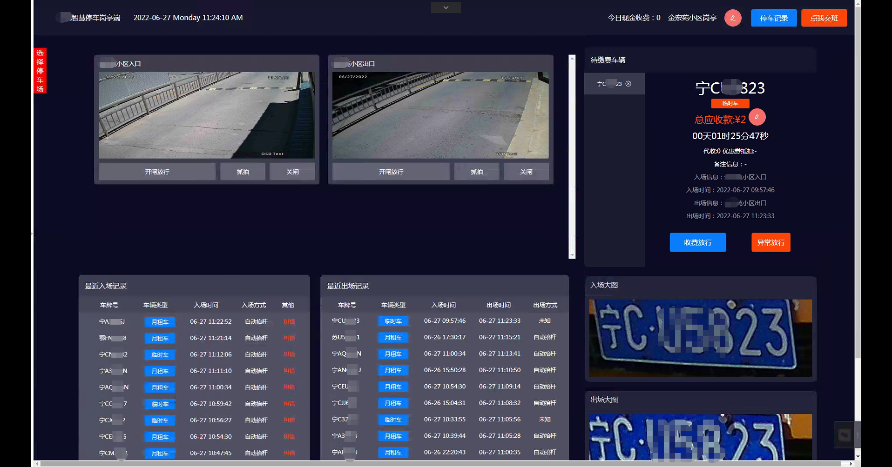

# 完整的商业版智能停车场系统岗亭端，电脑界面可能会存在变形，建议使用较大尺寸电脑屏幕浏览

【最新版本】：2024年10月15日，新鲜出炉。国内行业领导者，遥遥领先，自己下代码体验！国内唯一真正做到全国一张网，超级聚合的产品！真硬实力！

【功能简介】：车辆进出数据实时推送，基于websocket协议通讯，支持优惠设置，现金收费，一键异常放行，车牌纠错，停车记录查看，车辆进出图片显示和查看，局域网视频留超低延时监控播放(无视品牌，任何相机都能使用)等，老板，抓紧体验，你值得拥有！

【效果图】：


## 注意事项
```
①：请修改 文件目录下 src/config/index.js  相关配置
②：要修改二维码logo的，请注意替换  文件目录下 src/assets/image/qrcode-icon.png ，文件名要保持一致
```

## 技术栈
```
vue3版本
```

## 安装依赖（确保你本地已经安装了nodejs环境）
```
npm install
```

### 进行本地服务启动，查看效果
```
npm run serve
```

### 打包，上传到服务器正式环境
```
npm run build-r
```

【使用教程】：本代码全开源且完整，没有任何缺失和加密，不会存在我们故意动手脚导致你跑不起来的情况，建议使用Visual Studio Code打开和运行本代码

【注意事项】：启动前请 仔细查阅 配置文件说明。使用手册（请注意查阅） https://www.showdoc.com.cn/cfzhv3/11471322275035968

【关于后台服务数据】：https://www.showdoc.com.cn/cfzhv3/10290721898432961

【前端小程序开源地址】(3.0)：https://gitee.com/gebixiaowangzi/parking_system_applet

【后台管理开源地址】(3.0)：https://gitee.com/gebixiaowangzi/cfzhv3.0_public_admin

版权声明

【代码版权】：100%原创研发，免费开源给大家使用，若您使用在商业领域，请勿申请软著，否则可能会影响到其它爱好者合法使用，我方也会追究您的法律责任

【加密情况】：本项目代码100%源代码开放，不存在任何加密和缺失，不存在任何后门，请放心使用
